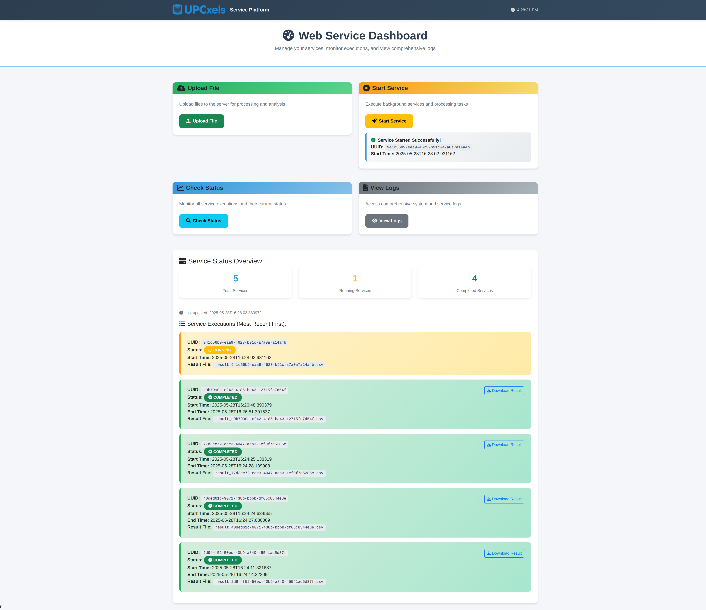

# EDC Web Service Dashboard

[](https://www.python.org/downloads/)
[](https://flask.palletsprojects.com/)

A modern Flask-based web service dashboard for managing file uploads, background service execution, and comprehensive monitoring with real-time logging capabilities.



## Features

- **📁 File Upload Management**: Secure file upload with validation and storage
- **⚙️ Service Orchestration**: Start and monitor background services with unique UUID tracking
- **📊 Real-time Monitoring**: Live status tracking of all service executions with detailed metrics
- **📥 Result Downloads**: Download CSV results for completed services with individual file management
- **📋 Comprehensive Logging**: Application-specific logs with filtering and real-time viewing
- **🎨 Modern UI**: Professional responsive dashboard built with Bootstrap 5 and Font Awesome icons
- **🔄 Concurrent Processing**: Support for multiple simultaneous service executions
- **⏰ Real-time Updates**: Live clock and automatic status refreshing

## Prerequisites

- Python 3.8 or higher
- pip (Python package installer)

## Installation

1. **Clone the repository**
```
git clone <repository-url>
cd <folder>
```

2. **Create virtual environment** (recommended)
```
python -m venv venv
source venv/bin/activate
```

3. **Install dependencies**
```
pip install -r requirements.txt
```

4. **Run the application**
```
python run.py
```

5. **Access the dashboard**
```
http://localhost:5000
```

## Usage

### Starting a Service
1. Click "Start Service" on the dashboard
2. A unique UUID will be generated for tracking
3. Monitor progress in the "Check Status" section

### Uploading Files
1. Click "Upload File" 
2. Select your file in the modal dialog
3. Files are stored in `data/uploads/`

### Monitoring Services
1. Click "Check Status" to view all services
2. See real-time status updates (Running/Completed/Error)
3. Download results for completed services

### Viewing Logs
1. Click "View Logs" to open the log viewer
2. Use "Refresh Logs" for latest entries
3. Logs show only application-specific events

## API Documentation

### Endpoints

| Endpoint | Method | Description | Parameters |
|----------|--------|-------------|------------|
| `/api/upload` | POST | Upload files | `file` (multipart) |
| `/api/start` | POST | Start background service | None |
| `/api/status` | GET | Check service status | None |
| `/api/download` | GET | Download results | `uuid` (optional) |
| `/api/logs` | GET | Retrieve application logs | None |

## Project Structure

```
edc_web/
├── app/ # Flask application core
│ ├── __init__.py # App factory and configuration
│ ├── config.py # Application settings
│ ├── resources/ # API endpoints
│ │   └── endpoints.py # RESTful API resources
│ └── templates/ # HTML templates
│     └── index.html # Main dashboard template
├── assets/ # Documentation assets
│ └── images/ # Screenshots for README
├── data/ # Application data storage
│ ├── uploads/ # User uploaded files
│ ├── results/ # Service execution results (CSV)
│ └── logs/ # Application logs
├── static/ # Static assets
│   └── images/ # Logo and UI images
├── requirements.txt # Python dependencies
├── run.py # Application entry point
└── README.md # Project documentation
```